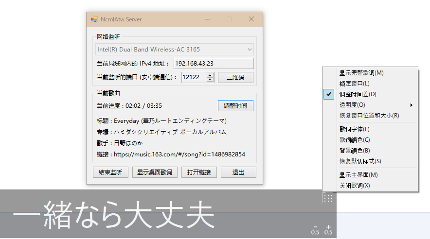

# NcmlAtw

+ NcmlAtw means "Netease Cloud Music Lyric, Android to Windows".
+ A set of tools that is used to subscribe the current playing songs from ncm for Android, and publish it to Windows to show lyrics on desktop.
+ Development environment: `.NET Framework 4.8` `Android 10` `ncm v8.1.70`.

### Screenshots

|||
|---|---|

### References

+ [Using MediaController on Android 5](https://stackoverflow.com/questions/27107212/using-mediacontroller-on-android-5)
+ [NeteaseMuiscApi](https://github.com/GEEKiDoS/NeteaseMuiscApi)
